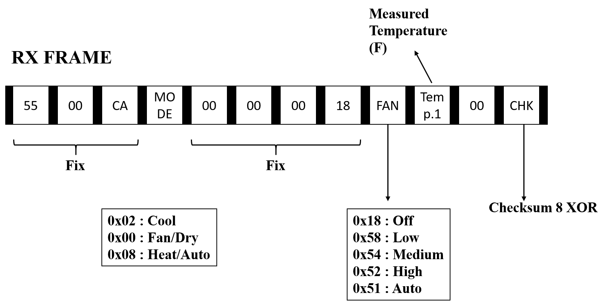

## Direct Data Transmit

  Communication between Esp32, Klima and Raspberry Pi was needed.
A protocol is required for devices to communicate with each other via Esp32.
The Mqtt library was selected to enable this communication.
Communication was provided by sending topic and message in Mqtt library communication.
Logged in via Wifi for mqtt connection.

  TX and RX pins are activated to send and receive signals from the A/C.
The signals produced by the A/C were received with the RX pin.
These signals separated the frame and these signals were sent to Mqtt and Raspberry Pi.
The data generated by the model was sent to Esp32 via Mqtt.
Esp32 data was sent to the A/C with TX pin in frames.

  A 128x64 OLED display was installed to examine the condition of the A/C.
In this screen, the air conditioner has temperature value, mode, fan speed, ON/OFF status and error code.
In case of error, the led installed in Esp32 flashes with the morse code according to the error code.

### Error Codes
    *Error 0: Wifi or Mqtt Connection error 
    *Error 1: POWERON_RESET bat power on reset
    *Error 2: 
    *Error 3: SW_RESET Software reset digital core
    *Error 4: OWDT_RESET Legacy watch dog reset digital core
    *Error 5: DEEPSLEEP_RESET Deep Sleep reset digital core
    *Error 6: SDIO_RESET Reset by SLC module, reset digital core
    *Error 7: TG0WDT_SYS_RESET Timer Group0 Watch dog reset digital core
    *Error 8: TG1WDT_SYS_RESET Timer Group1 Watch dog reset digital core
    *Error 9: RTCWDT_SYS_RESET RTC Watch dog Reset digital core
    *Error 10: INTRUSION_RESET Instrusion tested to reset CPU
    *Error 11: TGWDT_CPU_RESET Time Group reset CPU
    *Error 12: SW_CPU_RESET Software reset CPU
    *Error 13: RTCWDT_CPU_RESET RTC Watch dog Reset CPU
    *Error 14: EXT_CPU_RESET for APP CPU, reseted by PRO CPU
    *Error 15: RTCWDT_BROWN_OUT_RESET Reset when the vdd voltage is not stable
    *Error 16: RTCWDT_RTC_RESET RTC Watch dog reset digital core and rtc module
    
## Experience 
     *The communication between the A/C and the Esp32 is provided by the TTL protocol, not the RS485 protocol.
     *While the RX signal from the air conditioner can directly read the TX signal needs to be sent inversion.
     *ON TX signal :
        - 1., 2., 3., 6., 7. and 8.Byte is fixed.
        - 4.Byte : The first 4 bits of 4.Byte indicate the fan speed of the A/C and the last 4 bits indicate the Mode of the A/C.
        - 5.Byte : Displays the measured temperature (° F).
        - 9.Byte : The desired temperature (° C), respectively.
        - 10.Byte: ON/OFF indicates the status.
        - 11.Byte: The first 4 bits indicate the error code and the last 4 bits indicate deepswicth.
        - 12.Byte: Checksum 8-bit XOR is the frame used for error detection.

###### Figure 1: TX Frame

###### Figure 2: AC mods
     *ON RX signal :
        - 1., 2., 3.,5., 6., 7. ve 8.Byte is fixed.
        - 4.Byte : Indicates the mode of the A/C.
        - 9.Byte : Indicates the fan speed of the air conditioner.
        - 10.Byte: Shows the measured temperature (° F).
        - 11.Byte: Checksum 8-bit XOR is the frame used for error detection.

###### Figure 3: RX Frame
    *The air conditioner communicates with 115200 Baud Rate and Serial 8 bit even parity.
    *For Mqtt connection, firstly, Wifi connection should be observed to be error free.
    *The communication line with Mqtt should be listened continuously and operations should be started when the desired data is received.
    *In case of error occurrence, the WatchDog timer was used instead of developing the algorithm using EEPROM.

    
